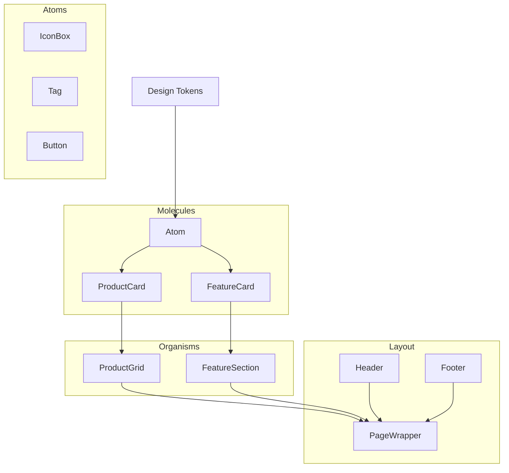

# Component Architecture

This document outlines how React/UI components are composed to build the NorAI interface.

## Dependency Graph

Our architecture favors composition over configuration. Smaller atomic components are injected into larger containers via `children` props or specific composition slots.

## Composition Rules

1. **Data fetching occurs at the Page level.** Components should be "dumb" and strictly handle presentation based on props.
2. **Avoid Prop Drilling.** If passing props down more than two levels, use composition (passing React nodes as `children`) or context.
3. **Styles are encapsulated.** A `Button` manages its own internal padding and colors. The parent container determines the button's margins and placement.
