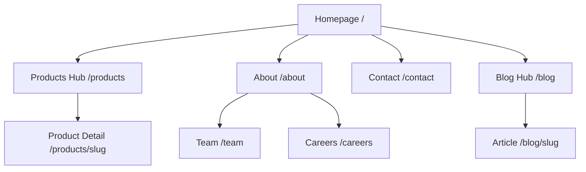

# Website Architecture

This document provides a high-level overview of the NorAI website's structural topology.

## Navigation Hierarchy
The site architecture is designed to be flat, meaning no page is more than 3 clicks away from the homepage.

**Primary (Header):**
- Products (Dropdown)
- About
- Blog
- Team
- CTA: Get Started

**Secondary (Footer):**
- Deep links to specific products
- Careers, Contact, Press
- Legal (Privacy, Terms)

## Page Hierarchy

## User Flows
- **The Core Funnel:** Homepage → Interactive Product Showcase → Contact Form.
- **The Evaluation Funnel:** About → Team → Product Details → Contact Form.
- **The Talent Funnel:** Blog (Engineering Insights) → Careers.

## Expansion Strategy
The architecture is designed to scale horizontally:
- **Phase 2:** Introduce a `Documentation` portal on a separate subdomain (`docs.noraitech.com`).
- **Phase 3:** Introduce SaaS Dashboards on (`app.noraitech.com`).
- The core marketing site will remain lean, serving strictly as the lead generation and brand authority layer.
