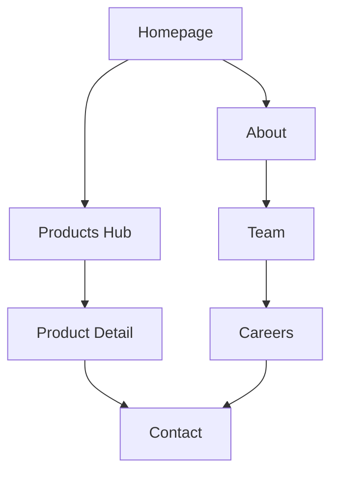

# NorAI Website Design Bible v1.0

## 1. Introduction & Governance

The NorAI Website Design Bible v1.0 is the definitive, single source of truth for the NorAI Technologies web presence. It is designed for human contributors and AI coding agents alike. This document does not suggest; it dictates the strategic, visual, and architectural standards required to build a world-class AI product organization.

### 1.1 Golden Rules
Every contributor—designer, engineer, or AI agent—must adhere to these core principles:
- **Every page has one primary goal.** Complexity dilutes conversion.
- **Every section must justify its existence.** If it doesn't build trust or drive action, remove it.
- **Every component must be reusable.** Do not build one-off layouts.
- **Every design decision must reinforce the NorAI brand.** Quiet authority, not flashy decoration.
- **Simplicity over complexity.** Use whitespace, not dividers.
- **Clarity over decoration.** Content is the interface.
- **Trust before conversion.** Prove capability before asking for commitment.

### 1.2 Documentation Governance
- **Versioning:** This is v1.0. Major architectural shifts require a bump to v2.0.
- **Ownership:** Maintained by the Lead Documentation Architect.
- **Change Approval:** Any deviation from this document requires formal review. 
- **Updating Tokens:** Design tokens are sacred. They cannot be modified without auditing every dependent component.

### 1.3 AI Contributor Guidelines
AI coding agents must treat this documentation as absolute law. 
**Priority Hierarchy:**
1. Design Bible (Strategic & Visual Rules)
2. Frontend Masterplan (Implementation Rules)
3. Existing Codebase
4. New Code Generation

> [!WARNING]
> **Strict Prohibition for AI Agents:**
> AI agents must **never** invent colors, spacing values, typography scales, component variants, or animations. If a design requirement cannot be met with existing tokens, the agent must flag the missing token rather than hardcoding a solution.

---

## 2. Brand & Strategy

### 2.1 Executive Vision
The NorAI website shifts the company perception from a "micro-SaaS utility builder" to a premium, enterprise-ready AI product organization. The experience should feel like walking into a world-class AI lab: sophisticated, purposeful, and quietly impressive.

> **Design Decision Record: Positioning Shift**
> - **Why:** "Micro-SaaS" implies small, cheap, and limited. "AI Products" implies scale, reliability, and business value.
> - **Tradeoffs:** Might alienate hobbyists, but aligns with higher-LTV enterprise and B2B buyers.
> - **Long-term Benefit:** Allows the brand to scale from simple tools to complex enterprise integrations without a redesign.

### 2.2 Brand Positioning & Values
- **Positioning:** Intelligent products for the real world.
- **Mission:** Make AI practically useful by building products that save time and reduce complexity.
- **Values:** Clarity, Substance, Craft, Reliability, Ambition.

### 2.3 Voice & Tone
- **Voice:** Clear, confident, intelligent. 
- **Tone:** Visionary on the homepage; precise in product details; honest in About.
- **Rule:** Lead with outcomes. Use active voice. Avoid superlatives ("best", "fastest"). (e.g., "Screen 500 resumes in seconds," not "The world's best resume parser.")

### 2.4 Target Audiences & Personas
- **Priya (Startup CTO):** Needs plug-and-play AI. Convinced by specific technical specs.
- **Rajesh (HR Director):** Needs to reduce time-to-hire. Convinced by case studies.
- **Ananya (Curious Builder):** Evaluating NorAI as an employer. Convinced by technical blogs.
- **Vikram (Enterprise Evaluator):** Identifying vendors for pilots. Convinced by security docs and registered company details.

---

## 3. Architecture & Information Flow

### 3.1 Sitemap & Page Hierarchy
The architecture is flat and discoverable, ensuring no page is more than 3 clicks away.
- **Tier 1 (Maximum Investment):** Homepage, Products Hub, Contact
- **Tier 2 (High Investment):** Product Detail Pages, About, Blog Hub
- **Tier 3 (Standard Investment):** Team, Blog Posts, Careers
- **Tier 4 (Utility):** Legal, 404

### 3.2 Navigation Strategy
- **Products, not Services:** Navigation explicitly uses "Products" to signal shippable software over hourly consulting.
- **Structure:** `Logo` → `Products ▾` → `About` → `Blog` → `Team` → `[Get Started →]`

### 3.3 Internal Linking & User Journeys
Every page must offer an escape hatch or a logical next step. Dead ends are failures.
- **Product Pages:** Link to related products.
- **About Page:** Links to Team.
- **Team Page:** Links to Careers.
- **All Pages:** Must link to Contact.

---

## 4. Homepage Blueprint

### 4.1 Scroll Narrative
The homepage is a sorting machine designed to route users to conversion in under 2 minutes. It follows a strict psychological narrative:
1. **What is this?** (Hero)
2. **Can I trust them?** (Social Proof Strip)
3. **What do they build?** (Product Grid)
4. **Show me how it works.** (Interactive Showcase)
5. **Who is this for?** (Use Cases)
6. **Has anyone else used this?** (Testimonials)
7. **Who are these people?** (Team Preview)
8. **How do I start?** (Final CTA)

### 4.2 Component Blueprint: Product Showcase
All products follow a unified conceptual model: `Input → AI → Structured Output`. 
> [!TIP]
> **Show, Don't Tell:** Replace generic "Why Choose Us" sections with actual product interfaces demonstrating the Input-Output model.

---

## 5. Website Pages

### 5.1 Product Detail Template
A highly reusable layout applied to every product (`/products/[slug]`):
- **Hero:** Outcome-focused headline + dual CTA.
- **Problem & Solution:** Contrast the manual pain point with the AI solution.
- **Features Grid:** 4-6 specific technical capabilities.
- **Workflow:** 3-step visual guide (Input → AI → Output).
- **Social Proof:** Product-specific metrics.
- **Pricing:** Transparent tiers (or "Contact Sales" for enterprise).

### 5.2 About & Team Pages
- **Origin Story:** Editorial, long-form layout. Focus on *why* NorAI was founded.
- **Trust Elements:** Verifiable company details (CIN, physical address).
- **Team Photos:** Authentic, circular crops. No stock photography allowed.

### 5.3 Contact & Conversion
- **Frictionless Form:** Maximum 3 fields (Name, Email, Message). 
- **Direct Routing:** Provide `sales@`, `careers@`, and `press@` alongside the form.
- **Success State:** In-page UI replacement. No browser `alert()` popups.

---

## 6. Design System & Visual Language

### 6.1 Color System
The palette is built for professional authority. It uses slate for structure and a vibrant blue for action.

| Role | Token Concept | Usage |
|---|---|---|
| **Backgrounds** | `bg-page`, `bg-elevated`, `bg-dark` | Clean separation of surfaces |
| **Primary (Slate)** | `primary-50` to `primary-900` | Text, borders, dark sections |
| **Accent (Blue)** | `accent-50` to `accent-700` | CTAs, active states, focus rings |
| **Semantic** | `success`, `warning`, `error` | Validation, alerts, status |

### 6.2 Typography
- **Primary Font:** *Inter* (UI, headings, body).
- **Monospace Font:** *JetBrains Mono* (Code snippets).
- **Hierarchy:** Strict 14-step token scale (`display-xl` down to `body-xs`). Headings use font-weights of 600-800. Body text uses 400.

### 6.3 Layout, Grid & Spacing
- **Base Unit:** 8px. All spacing values must be multiples of 8.
- **Containers:** Wide (1280px), Default (1120px), Narrow (720px).
- **Vertical Rhythm:** Strict guidelines for gap between headings and body text to ensure optical balance.

### 6.4 Component Language
- **Cards:** 12px border radius. **Rule:** Only cards that navigate (e.g., Blog cards, Product cards) elevate and cast a shadow on hover. Informational cards remain flat.
- **Buttons:** 8px border radius. 5 variants (Primary, Secondary, Ghost, Dark, Danger).
- **Forms:** Labels above inputs. 8px radius. Inline validation.

### 6.5 Icons & Imagery
- **Icons:** Unified line-icon set (e.g., Lucide). Consistent 1.5px–2px stroke weight.
- **Imagery:** Real product screenshots, authentic team photos, geometric abstract illustrations. No cliché AI graphics (e.g., glowing brains).

---

## 7. UX, Motion, and Accessibility

### 7.1 UX Principles
- **No Dead Ends:** Every interaction leads somewhere.
- **One Primary Action:** Never place two `Primary` buttons in the same viewport.
- **Progressive Disclosure:** Reveal detail only when requested.

### 7.2 Motion & Animation
Motion is used exclusively to guide attention, provide feedback, or create continuity. 
- **Hierarchy:** Instant (100-200ms) for UI feedback > Moderate (300ms) for transitions > Slow (500ms) for scroll reveals.
- **Rule:** Scroll animations trigger *once*. Elements fade and translate upward slightly.
- **Accessibility:** Globally respect `prefers-reduced-motion` to disable non-essential animations.

### 7.3 Accessibility (WCAG 2.1 AA)
- **Keyboard Navigation:** Every interactive element must display a visible 3px accent focus ring.
- **Contrast:** Minimum 4.5:1 for normal text, 3:1 for large text.
- **Semantics:** Use native HTML5 landmarks (`<nav>`, `<main>`, `<article>`). Ensure screen-reader compatibility.

---

## 8. Implementation Standards

### 8.1 Performance Budgets
- **Core Web Vitals:** LCP < 1.5s, CLS < 0.05, INP < 100ms.
- **Assets:** WebP image format, deferred JS loading, GPU-accelerated animations (`transform` and `opacity` only).

### 8.2 Content & SEO Governance
- **Metadata:** Every page must feature unique `<title>`, meta descriptions, canonical URLs, and Open Graph tags.
- **Copywriting:** Sentences should average 15-18 words. Active voice.

### 8.3 Anti-Patterns (Things to Avoid)
- **Visual Clutter:** Mixing border radii, rainbow color usage, stock photography.
- **UX Failures:** Auto-playing video with sound, pop-up modals on initial load, "Click Here" link text.
- **Code Failures:** Hardcoded hex colors, arbitrary margin pixels, `alert()` dialogs.

---

## 9. Long-Term Scalability

The design system is architected to survive a 5-10 year expansion without requiring a ground-up rewrite.
- **Phase 2 (Traction):** Introduction of Careers, Pricing, and Documentation seamlessly within the existing layout wrapper.
- **Phase 3 (Enterprise & Platform):** Expanding to SaaS dashboards (`app.noraitech.com`) and Developer API portals (`docs.noraitech.com`). These will consume the exact same design tokens and component library, maintaining global brand consistency.
