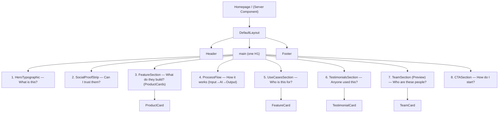

# 05_Phase4_Homepage_Assembly_Specification_v1.0

**Project:** NorAI Technologies Website — Phase 4: Homepage Assembly
**Status:** Immutable, production-ready engineering specification. Single source of truth for implementing the NorAI homepage.
**Authority (highest first):** Design Bible v1.0 → Frontend Masterplan v1.0 → Frontend_Architecture_Specification_v1.0 → 01_Project_Foundation (frozen) → 02A_Atoms (frozen) → 03_Phase2B_Molecules (frozen) → 04_Phase3_Organisms (frozen).
**Stack (fixed):** Next.js 15 (App Router) · React 19 · TypeScript · Tailwind CSS v4 (mapped to CSS-variable tokens) · Lucide React · Framer Motion · shadcn/ui (primitives only) · ESLint + Prettier · Mobile-first.

> Phase 4 is **pure composition**. It creates no component, token, layout, animation, or UX flow. It arranges frozen Organisms inside the frozen `DefaultLayout` in the exact Design Bible narrative order. The 4 prerequisite tokens (02A §11.1) and the validated Phase-3 substitution (`IconBox`→`Icon`; media via `next/image` + `Avatar`) are carried forward unchanged.

---

## 1. Executive Overview

**1.1 Purpose.** Assemble the NorAI homepage by composing frozen Organisms into the Design Bible's 8-step "sorting machine" scroll narrative (§4.1) that routes a visitor to conversion in under two minutes.

**1.2 Relationship with previous phases.** Phase 4 consumes Phase 1 (layout wrapper, providers, tokens, fonts, SEO helpers, hooks), Phase 2A/2B (atoms/molecules, indirectly), and Phase 3 (Organisms). It is the first "page" in the Masterplan build order (§5, Phase 4). It precedes Phase 5 core pages.

**1.3 Engineering philosophy.** System-first, page-second (Masterplan §2). The homepage route is a thin Server Component that renders Organisms in order, passes content via props, and delegates all interactivity to the Organisms' own Client subtrees. No logic, no fetching, no styling beyond layout rhythm already provided by Foundation.

**1.4 Scope.** The `/` route (`app/(marketing)/page.tsx`), its metadata, structured data, internal links, section ordering, content contracts, and section-level composition props.

**1.5 Out of scope.** Any change to Organisms/Molecules/Atoms/Foundation or their APIs; new sections; reordering; new tokens, layouts, animations, or UX flows; data fetching; CMS integration; other pages; Newsletter (excluded per Phase 3 §2).

---

## 2. Homepage Architecture

**2.1 Narrative → Organism mapping (fixed, exact order).**

| # | Narrative step (Design Bible §4.1) | Organism (frozen, Phase 3) |
|---|---|---|
| 1 | What is this? | `HeroTypographic` |
| 2 | Can I trust them? | `SocialProofStrip` |
| 3 | What do they build? | `ProductShowcase` = `FeatureSection` + product cards (see §3.3) |
| 4 | Show me how it works | `ProcessFlow` |
| 5 | Who is this for? | `UseCasesSection` |
| 6 | Has anyone used this? | `TestimonialsSection` |
| 7 | Who are these people? | `TeamSection` (Preview variant) |
| 8 | How do I start? | `CTASection` |

> **Product Showcase ruling (deterministic):** The Design Bible §4.2 requires the homepage "What do they build?" step to demonstrate products via the `Input → AI → Output` model. Phase 3 provides `FeatureSection` (with product content + `ProductCard`) for this. The homepage uses **`FeatureSection`** as the Product Showcase container, rendering `ProductCard`s. No new "ProductShowcase" Organism is created; the name denotes the composed section, not a new component.

**2.2 Composition tree.**

```
Homepage (/)  [Server Component]
└── DefaultLayout                      (frozen, (marketing)/layout.tsx)
    ├── Header                         (frozen Organism)
    ├── <main>                         (single landmark, one H1 inside Hero)
    │   ├── HeroTypographic            (1 — H1)
    │   ├── SocialProofStrip           (2 — LogoCloud variant)
    │   ├── FeatureSection             (3 — Product Showcase, renders ProductCard[])
    │   ├── ProcessFlow                (4 — Input → AI → Output, 3 steps)
    │   ├── UseCasesSection            (5 — FeatureCard grid)
    │   ├── TestimonialsSection        (6 — TestimonialCard[])
    │   ├── TeamSection                (7 — Preview variant, links to /team & Careers)
    │   └── CTASection                 (8 — OnDark or OnLight)
    └── Footer                         (frozen Organism)
```

**2.3 Mermaid diagram.**



---

## 3. Section-by-Section Specification

Organism-internal behavior is defined in Phase 3 and not repeated. Below specifies only homepage-level composition, props, and constraints.

### 3.1 Section 1 — Hero (`HeroTypographic`)
- **Purpose:** Answer "What is this?" instantly with an outcome-focused headline and dual CTA.
- **Primary user goal:** Understand NorAI's value and find the primary path forward.
- **Composition tree:** `HeroTypographic` → `Heading`(H1) + `Text`(subhead) + `CTAGroup`(primary+secondary) + optional `Pill` eyebrow.
- **Required components:** `HeroTypographic`, `CTAGroup`.
- **Allowed variants:** `HeroTypographic` Default only.
- **Spacing:** Top spacing clears sticky `Header`; generous vertical rhythm via `--space-*` (larger end of scale).
- **Container:** Default (1120), centered.
- **Accessibility:** Exactly one `H1` on the page lives here; primary CTA is the strongest affordance; single primary action in viewport.
- **Responsive:** Single column; CTAs stack + full-width on mobile; type via fixed scale only.
- **Motion:** Scroll-reveal once (fade + upward translate, `--duration-slow`); CTA hover per Atom; reduced-motion instant.
- **SEO:** Provides the page `H1`; headline should contain the primary value proposition keyword naturally.
- **Acceptance:** One H1; dual CTA with exactly one Primary; reveals once; no hardcoded values.

### 3.2 Section 2 — Social Proof (`SocialProofStrip`)
- **Purpose:** Answer "Can I trust them?" immediately after the hero.
- **Primary user goal:** Gain confidence via recognizable logos / trust indicators.
- **Composition tree:** `SocialProofStrip` → optional `Text` eyebrow + logo items + optional trust indicators (`Badge`/`StatusDot`).
- **Required components:** `SocialProofStrip`.
- **Allowed variants:** `LogoCloud` (mandatory for homepage). `TrustIndicators` optional if data provided.
- **Spacing:** Compact vertical rhythm; visually subordinate to hero.
- **Container:** Default (1120) or Wide (1280) for logo breathing room.
- **Accessibility:** Each logo has accessible name via `alt`; separators `aria-hidden`.
- **Responsive:** Wrap/scroll on mobile; single row ≥desktop; no page horizontal scroll.
- **Motion:** Scroll-reveal once; no marquee/autoplay.
- **SEO:** Logos are `next/image` with descriptive `alt`; no keyword stuffing.
- **Acceptance:** Real logos only; accessible names; reflow on mobile; no hardcoded values.

### 3.3 Section 3 — Product Showcase (`FeatureSection` + `ProductCard`)
- **Purpose:** Answer "What do they build?" using the `Input → AI → Output` demonstration model (Design Bible §4.2).
- **Primary user goal:** Grasp the product lineup and click into a product.
- **Composition tree:** `FeatureSection` → `Heading`(H2) + `Text` intro + grid of `ProductCard[]` (interactive) + optional `CTAGroup` (to Products Hub).
- **Required components:** `FeatureSection`, `ProductCard`.
- **Allowed variants:** `FeatureSection` `TextOnly` header + product grid; `ProductCard` `Default`.
- **Spacing:** Standard section rhythm; grid gaps via `--space-*`.
- **Container:** Default (1120).
- **Accessibility:** `H2`; each `ProductCard` is a single `<a>` (whole-card link); no nested interactive elements.
- **Responsive:** 1-up mobile → 2/3-up desktop via Foundation `Grid`.
- **Motion:** Section scroll-reveal once; `ProductCard` hover elevation + `--shadow-*` (interactive-card rule); reduced-motion disables elevation motion.
- **SEO:** Product names in card headings; each card links to `/products/[slug]` (internal linking).
- **Acceptance:** Products render as interactive elevating cards; links resolve; flat vs interactive rule honored; no hardcoded values.

### 3.4 Section 4 — Process Flow (`ProcessFlow`)
- **Purpose:** Answer "Show me how it works" with the unified 3-step model.
- **Primary user goal:** Understand the mechanism (Input → AI → Output).
- **Composition tree:** `ProcessFlow` → optional `Heading`(H2) + exactly 3 steps (`Icon` + `Heading` subhead + `Text`) + connector `Icon`.
- **Required components:** `ProcessFlow`.
- **Allowed variants:** `Horizontal` (≥tablet), `Vertical` (mobile).
- **Spacing:** Standard section rhythm; connector spacing via `--space-*`.
- **Container:** Default (1120).
- **Accessibility:** Ordered list semantics; connectors `aria-hidden`; step order announced.
- **Responsive:** Horizontal with connectors ≥tablet; stacked vertical on mobile.
- **Motion:** Scroll-reveal once; reduced-motion instant.
- **SEO:** Step titles reinforce capability keywords; decorative icons only.
- **Acceptance:** Exactly 3 steps; correct reflow; ordered semantics; no hardcoded values.

### 3.5 Section 5 — Use Cases (`UseCasesSection`)
- **Purpose:** Answer "Who is this for?" mapping personas to outcomes.
- **Primary user goal:** Self-identify with a use case.
- **Composition tree:** `UseCasesSection` → `Heading`(H2) + `FeatureCard[]` (flat) + optional `CTAGroup`.
- **Required components:** `UseCasesSection`, `FeatureCard`.
- **Allowed variants:** `TwoUp` or `ThreeUp`.
- **Spacing:** Standard section rhythm.
- **Container:** Default (1120).
- **Accessibility:** `H2`; `FeatureCard`s are non-interactive `<article>`; icons `aria-hidden`.
- **Responsive:** 1-up mobile → 2/3-up desktop.
- **Motion:** Scroll-reveal once; **no hover elevation** (informational, flat).
- **SEO:** Use-case titles convey audience/outcome language.
- **Acceptance:** Flat cards; EmptyState if no items; reflow; no hardcoded values.

### 3.6 Section 6 — Testimonials (`TestimonialsSection`)
- **Purpose:** Answer "Has anyone used this?" with authentic social proof.
- **Primary user goal:** Trust via peer validation.
- **Composition tree:** `TestimonialsSection` → `Heading`(H2) + `TestimonialCard[]`.
- **Required components:** `TestimonialsSection`, `TestimonialCard`.
- **Allowed variants:** `Grid` or `Single`.
- **Spacing:** Standard section rhythm.
- **Container:** Default (1120); quote-heavy content may use Narrow within cards.
- **Accessibility:** Cards use `<figure>`/`<blockquote>`+`<figcaption>`; avatars `alt`=author.
- **Responsive:** 1-up mobile → 2/3-up desktop.
- **Motion:** Scroll-reveal once; **no autoplaying carousel**; flat cards.
- **SEO:** Real attribution (name/role) in text; no fabricated quotes.
- **Acceptance:** Attribution mandatory; EmptyState if none; authentic avatars; no hardcoded values.

### 3.7 Section 7 — Team Preview (`TeamSection`, Preview variant)
- **Purpose:** Answer "Who are these people?" and route toward About/Team/Careers.
- **Primary user goal:** Humanize the company; find team/careers.
- **Composition tree:** `TeamSection`(Preview) → `Heading`(H2) + subset of `TeamCard[]` + `CTAGroup`/`Link` to `/team` (and Careers per no-dead-end rule).
- **Required components:** `TeamSection`, `TeamCard`.
- **Allowed variants:** `Preview` (mandatory here — subset, not full grid).
- **Spacing:** Standard section rhythm.
- **Container:** Default (1120).
- **Accessibility:** `H2`; avatars `alt`=name; authentic circular photos only.
- **Responsive:** 1-up mobile → 3/4-up desktop.
- **Motion:** Scroll-reveal once; flat cards (no hover elevation).
- **SEO:** Links to `/team` (internal linking); real names.
- **Acceptance:** Preview subset renders; link to full team present; no stock photos; no hardcoded values.

### 3.8 Section 8 — Final CTA (`CTASection`)
- **Purpose:** Answer "How do I start?" with the single strongest conversion prompt.
- **Primary user goal:** Convert (Get Started / Contact).
- **Composition tree:** `CTASection` → `Heading`(H2) + optional `Text` + `CTAGroup`(primary + optional secondary).
- **Required components:** `CTASection`, `CTAGroup`.
- **Allowed variants:** `OnDark` (recommended for closing emphasis) or `OnLight`.
- **Spacing:** Generous rhythm to signal conclusion.
- **Container:** Default (1120), centered.
- **Accessibility:** Exactly one primary action; contrast maintained on dark surface (`--bg-dark`).
- **Responsive:** Centered; CTAs stack + full-width on mobile.
- **Motion:** Scroll-reveal once.
- **SEO:** Primary CTA links to `/contact` or Get Started route (internal linking).
- **Acceptance:** One Primary; correct contrast on chosen surface; reveals once; no hardcoded values.

---

## 4. Layout Rules

| Rule | Specification |
|---|---|
| **Container usage** | All sections render inside Foundation `Section` + `Container` Default (1120). `SocialProofStrip` may use Wide (1280). No Narrow on the homepage. |
| **Vertical rhythm** | Inter-section spacing via `--space-*` only (larger end of base-8 scale); consistent top/bottom padding per section; hero clears the sticky `Header`. |
| **Section spacing** | Uniform section gap token applied between all 8 sections; no ad-hoc margins. |
| **Background transitions** | Alternate surfaces using only `--bg-page` / `--bg-elevated` / `--bg-dark`. `CTASection` `OnDark` uses `--bg-dark`. No gradients or invented surfaces. |
| **Responsive stacking** | Mobile-first; every multi-column grid collapses to single column at base (375px); scale up via `min-width`. |
| **Maximum widths** | 1280 (Wide) absolute cap; content centers with balanced gutters on ultra-wide; no full-bleed text. |
| **Alignment** | Hero and Final CTA centered; content sections left-aligned headers with grid bodies; consistent left edge within `Container`. |

---

## 5. Content Contracts

| Section | Required content | Optional content | Max recommended copy | CTA rule | Image/Illustration | Empty-state policy |
|---|---|---|---|---|---|---|
| Hero | Headline (H1), subhead, primary CTA | Eyebrow pill, secondary CTA | Headline ≤10 words; subhead ≤25 words | Exactly 1 Primary + ≤1 secondary | None or geometric abstract only | N/A (always present) |
| Social Proof | ≥1 logo | Eyebrow, trust indicators | Eyebrow ≤8 words | None | Real client/partner logos (`next/image`, `alt`) | Hide section if no logos (do not render empty) |
| Product Showcase | H2, ≥1 `ProductCard` (name, summary, href) | Intro, section CTA | Card summary ≤20 words | Optional single CTA to Products Hub | Real product screenshots (`next/image`) | Hide section if no products |
| Process Flow | Exactly 3 steps (title + description) | H2 | Step description ≤15 words | None | Lucide `Icon` per step (decorative) | N/A (always 3 steps) |
| Use Cases | H2, ≥2 use cases (title, description) | Icon, section CTA | Description ≤18 words | Optional single CTA | Decorative `Icon` | `EmptyState` if none |
| Testimonials | H2, ≥1 testimonial (quote, name, role) | Avatar | Quote ≤40 words | None | Authentic `Avatar` (circular) only | `EmptyState` if none |
| Team Preview | H2, subset of members (name, role, photo), link to /team | Socials | Role ≤6 words | Link/CTA to team + careers mandatory | Authentic circular photos only | `EmptyState` if none |
| Final CTA | H2, primary CTA | Body text, secondary CTA | Heading ≤12 words; body ≤25 words | Exactly 1 Primary | None or geometric abstract | N/A (always present) |

**Global content rules (Design Bible §2.3, §8.2):** Active voice; sentences average 15–18 words; lead with outcomes; avoid superlatives; no "Click Here"; no cliché AI graphics (glowing brains); no stock photography.

---

## 6. Homepage State Architecture

| Concern | Specification |
|---|---|
| **Server vs Client** | The `/` route and all static sections are **Server Components**. Only interactive Organism subtrees are Client: `Header` (menu), `ProductCard`/`BlogCard` hover is CSS (no client needed), scroll-reveal wrappers (client where Framer Motion runs). No page-level Client component. |
| **Loading behavior** | Homepage content is static/props-driven; no route-level `loading.tsx` spinner required. Media uses `next/image` with dimensions to protect CLS. If any section receives a pending flag, it renders the Organism's own `LoadingState`. |
| **Hydration boundaries** | Hydration limited to `Header` and scroll-reveal/motion wrappers. Static sections ship zero client JS. |
| **Error handling** | Route inherits `app/error.tsx`; sections render their own `EmptyState`/`ErrorState` presentation only. No `alert()`. |
| **No business logic** | Page passes static content via props; no computation, no domain rules. |
| **No API fetching in presentation** | Presentation components never fetch. If content later comes from CMS, it is resolved in the Server Component route boundary and passed down — out of Phase 4 scope. |

---

## 7. SEO Architecture

| Item | Specification |
|---|---|
| **Metadata** | Route exports unique `title` and meta `description` via the Phase 1 `lib/seo/` builder; `metadataBase` from `NEXT_PUBLIC_SITE_URL`. |
| **Open Graph / Twitter** | OG title, description, and default OG image from `public/og/`; Twitter card populated. |
| **Structured data** | JSON-LD `Organization` (name, logo, URL, contact) via Phase 1 `lib/seo/` helper. Optional `WebSite`. No fabricated ratings/reviews. |
| **Heading hierarchy** | Exactly one `H1` (Hero). All section headings `H2`; sub-items `H3`+. No skipped levels. |
| **Internal linking** | Product Showcase → `/products/[slug]`; Team Preview → `/team` (+ Careers); Final CTA → `/contact` or Get Started. Every page links to Contact (no dead ends). |
| **Canonical** | Canonical URL = site root, resolved via `lib/seo/` canonical helper. |

---

## 8. Accessibility Requirements (WCAG 2.1 AA)

- **Landmarks:** One `<header>`(nav), one `<main>`, one `<footer>` (from `DefaultLayout`); sections use `<section>`/`<article>`/`<figure>` as defined by their Organisms.
- **Heading order:** Single `H1` in Hero; sequential `H2` per section; no level skips.
- **Keyboard navigation:** All interactive elements (nav, CTAs, product/team links, FAQ-free page) operable via Tab/Enter/Space; visible 3px `--accent` focus ring on `:focus-visible`.
- **Focus order:** DOM order equals visual order: Header → Hero → sections 2–8 → Footer; mobile menu traps focus when open and restores on close.
- **Reduced motion:** All scroll reveals and hover elevations disabled under `prefers-reduced-motion`; final states rendered instantly.
- **Screen readers:** Whole-card links have a single accessible name; decorative icons/logos/connectors `aria-hidden` or empty `alt`; testimonials use blockquote/figure; team avatars `alt`=name.
- **Contrast:** ≥4.5:1 normal, ≥3:1 large/non-text across `--bg-page`/`--bg-elevated`/`--bg-dark`; color never the sole signal.
- **Touch targets:** ≥44×44px on mobile for all interactive elements.

---

## 9. Motion Specification

| Aspect | Specification |
|---|---|
| **Scroll reveal usage** | Each of the 8 sections reveals **once** via `useScrollReveal` (IntersectionObserver, fire-once): fade + slight upward translate. No re-trigger on scroll-up. |
| **Animation timing** | Reveals use `--duration-slow` (500ms); interaction feedback `--duration-fast` (100–200ms); menu/dropdown transitions moderate (300ms). All easing `--ease-smooth`. |
| **Reduced motion** | `usePrefersReducedMotion` disables reveals, hover elevation, and menu motion; content appears in final state instantly. |
| **Allowed transforms** | `transform` and `opacity` only (GPU-accelerated). No width/height/top/left/color-layout animation. |
| **Animation sequencing** | One reveal per section; no per-child staggered cascades beyond the single section reveal; sections do not animate simultaneously off-screen. |
| **Interaction animations** | Provided solely by Atoms/Organisms (button hover/press, interactive card hover elevation). Phase 4 adds none. |

---

## 10. Performance Requirements

| Item | Specification |
|---|---|
| **Server rendering** | Homepage server-rendered/statically generated; static sections ship zero client JS. |
| **Image optimization** | All imagery via `next/image`, WebP, explicit dimensions; hero/above-the-fold LCP image `priority`; logos/screenshots sized to layout. |
| **Lazy loading** | Below-the-fold images lazy-loaded by default; Framer Motion loaded only where reveal/motion runs; no eager loading of off-screen media. |
| **Core Web Vitals** | LCP < 1.5s, CLS < 0.05, INP < 100ms (hard gates). Reserve space for all media to protect CLS. |
| **Hydration limits** | Client hydration confined to `Header` + motion/reveal wrappers; no page-level client boundary. |

---

## 11. Testing Requirements

| Test type | Requirement |
|---|---|
| **Unit** | Homepage renders all 8 sections in exact narrative order; each section receives required props; hidden sections (no logos/products) do not render. |
| **Component integration** | Each Organism receives valid content contracts; `ProductCard` links resolve to `/products/[slug]`; Team Preview links to `/team`; Final CTA links to conversion route. |
| **Accessibility** | Automated a11y (axe) zero critical violations; single H1; landmark uniqueness; focus-order test; keyboard-only walkthrough; reduced-motion assertion. |
| **Visual regression** | Snapshots at 375px, tablet, desktop, ultra-wide for each section and full page; light and dark (`CTASection`) surfaces. |
| **Homepage E2E flow** | Load `/` → verify order → keyboard-tab through Header→sections→Footer → activate primary CTA reaches conversion route → open/close mobile menu with focus trap → verify no horizontal scroll at 375px → verify LCP/CLS within budget in a Lighthouse/CWV check. |

---

## 12. Definition of Done

- [ ] `/` renders `DefaultLayout` with `Header`, single `<main>`, `Footer`.
- [ ] Exactly the 8 sections, in exact Design Bible order, no additions, no reorder.
- [ ] Every section composes only frozen Organisms; no API modified; no new component/token/layout/animation/flow introduced.
- [ ] Exactly one `H1` (Hero); all other section headings `H2`; no skipped levels.
- [ ] Exactly one Primary CTA per viewport; Hero and Final CTA each have a single Primary.
- [ ] Product Showcase renders interactive elevating `ProductCard`s linking to `/products/[slug]`; informational sections (Use Cases, Testimonials, Team) render flat cards.
- [ ] Content contracts (§5) satisfied; copy within recommended lengths; active voice; no superlatives; no "Click Here".
- [ ] No stock photography; authentic circular team photos; real logos; no cliché AI graphics.
- [ ] All imagery via `next/image` (WebP, dimensions); above-the-fold LCP image `priority`.
- [ ] Zero hardcoded color/space/type/radius/shadow/motion values; only existing tokens (4 prerequisite tokens from 02A §11.1 defined beforehand).
- [ ] Scroll reveals fire once, `transform`/`opacity` only, token timing; `prefers-reduced-motion` disables non-essential motion.
- [ ] Landmarks unique; keyboard-operable; visible 3px `--accent` focus ring; focus order matches visual order; mobile menu focus trap + restore.
- [ ] Contrast ≥4.5:1 / ≥3:1 across all surfaces; color not sole signal; touch targets ≥44px.
- [ ] Static sections ship zero client JS; hydration limited to Header + motion wrappers.
- [ ] SEO: unique title/description/canonical, OG + Twitter, `Organization` JSON-LD; internal links to Products, Team, Contact.
- [ ] Core Web Vitals: LCP < 1.5s, CLS < 0.05, INP < 100ms verified.
- [ ] Unit, integration, a11y, visual-regression, and E2E tests pass; lint, type-check, build clean.
- [ ] No dead ends: every path offers a next step; every page (incl. homepage) links to Contact.

---

## 13. Explicit Constraints (restated, binding)

Phase 4 does **not** redesign Organisms, invent reusable components, modify APIs, invent tokens, invent layouts, invent animations, or introduce new UX flows. It is **pure composition** of the completed design system into the fixed 8-step narrative. Any need that cannot be met with an existing component/token is **flagged**, never improvised.

---

*End of 05_Phase4_Homepage_Assembly_Specification_v1.0. Composed strictly from frozen phases and the Design Bible narrative; no design decision, token, component, or flow invented. Carries forward the four prerequisite tokens (02A §11.1) and the validated Phase-3 substitution (`IconBox`→`Icon`; media via `next/image` + `Avatar`).*
