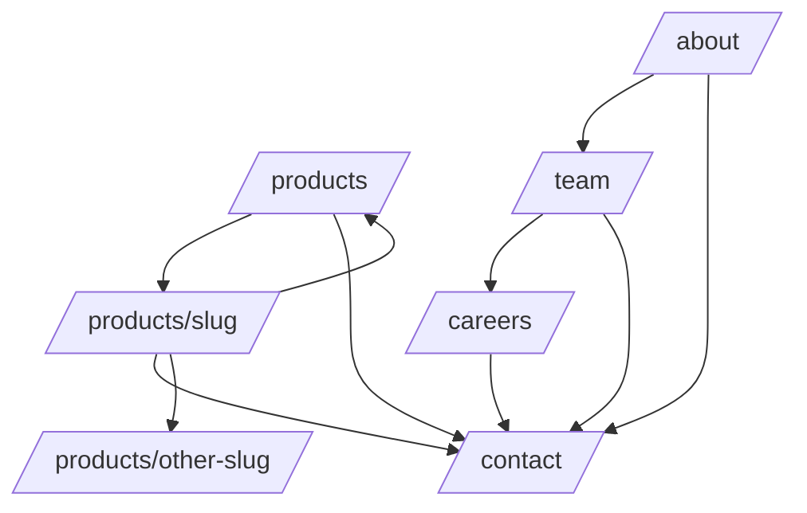

# 06_Phase5_Core_Pages_Specification_v1.0

**Project:** NorAI Technologies Website — Phase 5: Core Marketing Pages
**Status:** Immutable, implementation-ready contract. Ready to freeze.
**Authority (highest first):** Design Bible v1.0 → Frontend Masterplan v1.0 → Frontend_Architecture_Specification_v1.0 → 01_Project_Foundation (frozen) → 02A_Atoms (frozen) → 03_Phase2B_Molecules (frozen) → 04_Phase3_Organisms (frozen) → 05_Phase4_Homepage_Assembly (frozen).
**Stack (fixed):** Next.js 15 (App Router) · React 19 · TypeScript · Tailwind CSS v4 (tokens as CSS variables) · Lucide React · Framer Motion · shadcn/ui (primitives only) · ESLint + Prettier · Mobile-first.

> Phase 5 is **pure composition** of frozen components into six routes. It MUST NOT create components, tokens, layouts, animations, or flows. The four prerequisite tokens (02A §11.1) and the validated Phase-3 substitution (`IconBox`→`Icon`; media via `next/image` + `Avatar`) are carried forward unchanged. No contradiction with frozen specs is introduced; none was found (see §14.1).

---

## 1. Architecture Rules

1.1 **Page composition philosophy.** Every page MUST be assembled exclusively from frozen Foundation, Atoms, Molecules, Organisms, Layouts, and Templates. Pages own no visual logic beyond ordering Organisms and passing content via props (Masterplan §2, "System first, pages second").

1.2 **Frozen architecture reuse.** Pages MUST NOT redesign, wrap, or alter frozen components or their APIs. Where a Template exists (`ProductDetailTemplate`, `HubTemplate` — Frontend_Architecture_Specification §2 Templates), pages MUST use it rather than re-composing its shape.

1.3 **Server/Client rules.** Route entry files (`page.tsx`) MUST be Server Components. Client behavior MUST remain confined to the interactive Organism subtrees defined in Phase 3 (`Header` menu, `ContactSection` form, `ProcessFlow`/scroll-reveal wrappers). No page introduces a page-level Client boundary.

1.4 **Layout reuse.** `/products`, `/products/[slug]`, `/about`, `/team`, `/careers` MUST use `DefaultLayout` (marketing route group). `/contact` MUST use `DefaultLayout` and render `ContactSection` in its `Split` variant (SplitLayout is applied *inside* the section per Frontend_Architecture_Specification §3, not as a separate route wrapper). No alternative layout MUST be introduced.

1.5 **Dependency rules.** Pages MAY import Organisms, Templates, Layouts, Foundation, and `lib/seo`. Pages MUST NOT import Atoms/Molecules directly except Foundation `Container`/`Section`/`Heading`/`Text` where an Organism does not already provide the wrapper. Pages MUST NOT import services, schemas, or perform data fetching inside presentation; static content MUST be passed from the Server Component route boundary.

1.6 **Metadata rules.** Every route MUST export unique metadata via the Phase 1 `lib/seo/` builder: `title`, `description`, canonical, OpenGraph, Twitter. `/products/[slug]` MUST use `generateMetadata` keyed on `slug`. Missing metadata is a build-blocking failure.

1.7 **Routing conventions.** Segments are lowercase; the single dynamic segment is `[slug]`. `generateStaticParams` MUST enumerate known product slugs for static generation. Unknown slugs MUST resolve to the frozen `not-found` handling (Phase 1) — Phase 5 does not define 404 UI (out of scope).

1.8 **Internal linking philosophy.** No dead ends (Design Bible §3.3). Every page MUST link to Contact and MUST provide a logical next step. Contextual links MUST follow the Design Bible journey graph (§3.3).

---

## 2. Route Inventory

| Route | Purpose | Layout | Page ownership | SEO expectation |
|---|---|---|---|---|
| `/products` | Products Hub — list all products, route to detail | DefaultLayout + `HubTemplate` | Server Component | Unique title/desc; `ItemList` JSON-LD |
| `/products/[slug]` | Product Detail — convert on a single product | DefaultLayout + `ProductDetailTemplate` | Server Component; `generateStaticParams` + `generateMetadata` | Per-product title/desc/canonical; `Product` JSON-LD |
| `/about` | Company origin, mission, trust | DefaultLayout | Server Component | Unique title/desc; `Organization`/`AboutPage` JSON-LD |
| `/team` | Full team, route to Careers | DefaultLayout | Server Component | Unique title/desc |
| `/careers` | Open roles, route to Contact | DefaultLayout | Server Component | Unique title/desc |
| `/contact` | Frictionless conversion | DefaultLayout | Server shell; `ContactSection` Client subtree | Unique title/desc; `ContactPage`/`Organization` JSON-LD |

---

## 3. Page Specifications

Organism-internal behavior is defined in Phase 3 and MUST NOT be repeated or altered. Each page below specifies ordering, variants, content contracts, and links only. Every composition tree is deterministic; `(mandatory)` and `(optional)` are binding.

### 3.1 Products Hub — `/products`

- **Purpose:** Present the full product lineup and route users into product detail pages.
- **User intent:** "What do they build, and which product fits me?"
- **Information hierarchy:** H1 (hub headline) → product grid → conversion CTA.
- **Psychological flow:** Orient → scan products → self-select → click into detail.
- **Composition tree (deterministic):**

```
DefaultLayout
└── HubTemplate
    ├── HeroStandard            (mandatory, TextOnly, H1)
    ├── FeatureSection          (mandatory — product grid of ProductCard[] Expanded)
    ├── SocialProofStrip        (optional — LogoCloud)
    └── CTASection              (mandatory — to /contact)
```

- **Required sections:** `HeroStandard`, product grid (`FeatureSection` + `ProductCard` Expanded), `CTASection`.
- **Optional sections:** `SocialProofStrip`.
- **Forbidden sections:** Pricing, Testimonials carousel, ProcessFlow, Team.
- **CTA behavior:** Each `ProductCard` is a whole-card link to `/products/[slug]`. Exactly one Primary CTA in view (final `CTASection`).
- **Content contracts:** Hub headline ≤10 words; product card summary ≤20 words; ≥1 product MUST render; if zero products, section MUST render `EmptyState` (never an empty grid).
- **Responsive:** 1-up mobile → 2/3-up desktop grid; Default container (1120).
- **Accessibility:** One H1; product cards single `<a>`; grid uses list semantics where the Organism defines them.
- **SEO:** `ItemList` JSON-LD enumerating products; canonical `/products`.
- **Internal links:** → each `/products/[slug]`; → `/contact`.

### 3.2 Product Detail Template — `/products/[slug]`

- **Purpose:** Convert on a single product using the frozen `ProductDetailTemplate`.
- **User intent:** "Does this specific product solve my problem, and how do I start?"
- **Information hierarchy:** H1 (outcome headline) → problem/solution → features → workflow → proof → pricing → CTA.
- **Psychological flow (Design Bible §5.1):** Outcome → contrast pain vs solution → capabilities → mechanism → proof → price → convert.
- **Composition tree (deterministic, order fixed per Design Bible §5.1):**

```
DefaultLayout
└── ProductDetailTemplate
    ├── HeroStandard            (mandatory, WithMedia, H1, dual CTA)
    ├── FeatureSection          (mandatory — Problem vs Solution contrast)
    ├── FeatureGrid             (mandatory — 4–6 FeatureCard capabilities)
    ├── ProcessFlow             (mandatory — Input → AI → Output, 3 steps)
    ├── StatisticsSection       (optional — product-specific metrics)
    ├── TestimonialsSection     (optional — product-specific)
    ├── PricingSection          (mandatory — tiers or Contact Sales)
    ├── FAQSection              (optional)
    └── CTASection              (mandatory — to /contact)
```

- **Required sections:** `HeroStandard`, `FeatureSection` (problem/solution), `FeatureGrid`, `ProcessFlow`, `PricingSection`, `CTASection`.
- **Optional sections:** `StatisticsSection`, `TestimonialsSection`, `FAQSection`.
- **Forbidden sections:** Team, Blog, unrelated product grids (related-product links go in CTA/footer context).
- **CTA behavior:** Hero dual CTA (one Primary → Get Started/Contact; secondary → Pricing anchor). `PricingSection` — exactly one CTA per tier. Final `CTASection` single Primary. Enterprise tier MUST show "Contact Sales" instead of price.
- **Content contracts:** Outcome headline ≤10 words; `FeatureGrid` MUST contain 4–6 items; `ProcessFlow` MUST contain exactly 3 steps; feature descriptions ≤18 words.
- **Responsive:** Hero split collapses to stacked; grids 1-up mobile → 2/3-up desktop.
- **Accessibility:** One H1; sequential H2 per section; pricing feature lists are real `<ul>`.
- **SEO:** `generateMetadata(slug)`; `Product` JSON-LD (name, description); canonical `/products/[slug]`; `generateStaticParams` for known slugs.
- **Internal links:** → related products (contextual); → `/contact`; → Pricing anchor within page.

### 3.3 About — `/about`

- **Purpose:** Establish trust and mission; route to Team.
- **User intent:** "Who are they, why do they exist, can I trust them?"
- **Information hierarchy:** H1 → origin story → mission/values → trust elements → team link.
- **Psychological flow:** Vision → story → substance → verifiable trust → people.
- **Composition tree (deterministic):**

```
DefaultLayout
├── HeroStandard               (mandatory, TextOnly, H1)
├── FeatureSection             (mandatory — origin story, editorial long-form)
├── Timeline                   (optional — milestones)
├── StatisticsSection          (optional — company facts)
├── SocialProofStrip           (mandatory — TrustIndicators: CIN, address)
├── TeamSection                (mandatory — Preview variant → /team)
└── CTASection                 (mandatory — to /contact)
```

- **Required sections:** `HeroStandard`, `FeatureSection` (origin), `SocialProofStrip` (TrustIndicators), `TeamSection` (Preview), `CTASection`.
- **Optional sections:** `Timeline`, `StatisticsSection`.
- **Forbidden sections:** Pricing, Product grid, Blog.
- **CTA behavior:** `TeamSection` links to `/team`; final `CTASection` single Primary to `/contact`.
- **Content contracts:** Origin story is editorial long-form (Narrow reading width inside its section); trust indicators MUST be verifiable (CIN, physical address — Design Bible §5.2).
- **Responsive:** Long-form uses Narrow (720) within section; other sections Default (1120).
- **Accessibility:** One H1; `<article>` for origin story; trust values in text.
- **SEO:** `Organization`/`AboutPage` JSON-LD with verifiable details; canonical `/about`.
- **Internal links:** → `/team`; → `/contact`.

### 3.4 Team — `/team`

- **Purpose:** Present the full team; route to Careers.
- **User intent:** "Who works here; would I work with/for them?"
- **Information hierarchy:** H1 → full team grid → Careers CTA.
- **Composition tree (deterministic):**

```
DefaultLayout
├── HeroStandard               (mandatory, TextOnly, H1)
├── TeamSection                (mandatory — FullGrid → TeamCard[])
└── CTASection                 (mandatory — to /careers, secondary → /contact)
```

- **Required sections:** `HeroStandard`, `TeamSection` (FullGrid), `CTASection`.
- **Optional sections:** none.
- **Forbidden sections:** Pricing, Product grid, Testimonials.
- **CTA behavior:** `CTASection` Primary → `/careers`; secondary → `/contact`.
- **Content contracts:** Authentic circular photos only; role ≤6 words; if zero members, `EmptyState`.
- **Responsive:** 1-up mobile → 3/4-up desktop.
- **Accessibility:** One H1; avatars `alt`=name; `<article>` per member.
- **SEO:** Unique title/desc; canonical `/team`.
- **Internal links:** → `/careers`; → `/contact`.

### 3.5 Careers — `/careers`

- **Purpose:** Present openings and route interested candidates to Contact.
- **User intent:** "Are there roles for me and how do I apply?"
- **Information hierarchy:** H1 → why-work-here → open roles → apply CTA.
- **Composition tree (deterministic):**

```
DefaultLayout
├── HeroStandard               (mandatory, TextOnly, H1)
├── FeatureSection             (optional — culture/values)
├── UseCasesSection            (optional — reused as "why work here" via FeatureCard[])
├── FeatureGrid                (mandatory — open roles as FeatureCard[] or EmptyState)
└── CTASection                 (mandatory — apply via careers@ / /contact)
```

- **Required sections:** `HeroStandard`, roles list (`FeatureGrid`), `CTASection`.
- **Optional sections:** `FeatureSection`, `UseCasesSection`.
- **Forbidden sections:** Pricing, Product grid, Testimonials, Team full grid.
- **CTA behavior:** Each role card links to Contact or `mailto:careers@` (routing per Design Bible §5.3). Final `CTASection` single Primary → `/contact`.
- **Content contracts:** If no open roles, `FeatureGrid` MUST render `EmptyState` with a next step (submit interest → Contact). No dead end.
- **Responsive:** 1-up mobile → 2/3-up desktop.
- **Accessibility:** One H1; role cards flat/informational unless they are links (then single `<a>`).
- **SEO:** Unique title/desc; canonical `/careers`. `JobPosting` JSON-LD is OUT OF SCOPE (no CMS/role schema frozen) — MUST NOT be invented; documented as a gap in §14.2.
- **Internal links:** → `/contact`; → `mailto:careers@`.

### 3.6 Contact — `/contact`

- **Purpose:** Frictionless conversion (Design Bible §5.3).
- **User intent:** "Reach NorAI quickly."
- **Information hierarchy:** H1 → form (3 fields) + direct routing → success state.
- **Composition tree (deterministic):**

```
DefaultLayout
├── HeroStandard               (mandatory, TextOnly, H1)  [optional; MAY be omitted if ContactSection owns heading]
└── ContactSection             (mandatory — Split variant)
    ├── FormField ×3            (Name, Email, Message)
    ├── CTAGroup                (single submit Primary)
    ├── SocialLinks / mailto    (sales@, careers@, press@)
    └── Alert / Toast           (success/error, in-page)
```

- **Required sections:** `ContactSection` (Split). `HeroStandard` optional; if omitted, `ContactSection` MUST provide the single H1.
- **Optional sections:** `HeroStandard`.
- **Forbidden sections:** Pricing, Product grid, Team, Testimonials, more than 3 form fields.
- **CTA behavior:** Exactly one Primary submit. Direct routing (`sales@`, `careers@`, `press@`) MUST be present alongside the form.
- **Content contracts:** Maximum 3 fields (Name, Email, Message). Success MUST be an in-page UI replacement; browser `alert()` is FORBIDDEN. Submission MUST call a prop callback (Server Action wiring is Phase-1/owning-boundary responsibility, invoked by `ContactSection`); Phase 5 MUST NOT add validation/business logic.
- **Responsive:** Split → stacked single column on mobile.
- **Accessibility:** One H1; every field labeled via `FormField`; errors linked via `aria-describedby`; success/error announced via live region.
- **SEO:** `ContactPage`/`Organization` JSON-LD; canonical `/contact`.
- **Internal links:** direct email routes; every other page links here.

---

## 4. Component Composition Rules

4.1 **Reused Foundation:** `Container`, `Section`, `Grid`, `Stack`, `Heading`, `Text`, `VisuallyHidden`.

4.2 **Reused Layouts/Templates:** `DefaultLayout`; `HubTemplate` (`/products`); `ProductDetailTemplate` (`/products/[slug]`).

4.3 **Reused Organisms:** `Header`, `Footer`, `HeroStandard`, `FeatureSection`, `FeatureGrid`, `ProcessFlow`, `StatisticsSection`, `SocialProofStrip`, `TestimonialsSection`, `PricingSection`, `FAQSection`, `TeamSection`, `CTASection`, `ContactSection`, `Timeline`, `UseCasesSection`, and card Organisms (`ProductCard`, `FeatureCard`, `TeamCard`, `TestimonialCard`, `PricingCard`).

4.4 **Reused Molecules/Atoms:** only transitively through Organisms, plus `FormField`, `CTAGroup`, `SocialLinks`, `Alert`, `Toast`, `EmptyState` as already composed inside their Organisms. Direct atom/molecule import by a page is FORBIDDEN except Foundation wrappers (§1.5).

4.5 **Explicitly FORBIDDEN:** duplicated components; alternative layouts; unnecessary wrapper elements around Organisms; reinvented primitives; new reusable components. A new reusable component MUST NOT be created; if one appears genuinely required, the implementer MUST STOP and document the gap (§14.2) rather than build it.

---

## 5. Internal Linking Rules (navigation graph)



5.1 **No dead ends.** Every page MUST link to `/contact` and provide one logical next step.
5.2 **Conversion flow.** Products → Detail → Contact is the primary funnel; About → Team → Careers → Contact is the trust funnel.
5.3 **Contextual links.** Product Detail MUST link to related products; About MUST link to Team; Team MUST link to Careers.
5.4 **Breadcrumbs.** `/products/[slug]` MUST render `Breadcrumb` (`HeroStandard` WithMedia allows optional breadcrumb) reflecting `Products / <Product>`. `/products` and top-level pages MUST NOT render a breadcrumb (they are Tier-1/Tier-2 roots).
5.5 **CTA destinations (fixed):** Hub final CTA → `/contact`; Detail hero Primary → Get Started/`/contact`; About/Team/Careers final CTA → `/contact` (Team Primary → `/careers`).

---

## 6. Content Contracts

| Rule | Specification |
|---|---|
| Heading limits | One H1 per page; H1 ≤10 words; section H2 ≤8 words |
| Paragraph limits | Body paragraphs ≤3 sentences; sentences average 15–18 words (Design Bible §8.2) |
| CTA wording | Verb-led, outcome-focused; "Click Here" FORBIDDEN; e.g. action + object |
| Tone of voice | Clear, confident, intelligent; visionary on About, precise on Product Detail, honest throughout (Design Bible §2.3) |
| Prohibited language | Superlatives ("best", "fastest"); "micro-SaaS"; hype adjectives |
| AI claim restrictions | Claims MUST be outcome-specific and verifiable (e.g. quantified outcome), not generic AI superlatives; no fabricated metrics; no unverifiable capability claims |

---

## 7. Responsive Rules

7.1 Mobile-first; all pages authored at 375px then scaled via `min-width`. Zero horizontal scroll at 375px (hard gate).
7.2 Containers: Default (1120) for all sections except About origin story (Narrow 720) and optional Wide (1280) for `SocialProofStrip` logo rows.
7.3 Stacking: every multi-column grid and split collapses to single column at base; scale to 2-up (tablet), 2/3-up (desktop) via Foundation `Grid`.
7.4 Grid behavior: `FeatureGrid` 4–6 items reflow 1→2→3; `TeamSection` FullGrid 1→3→4; `PricingSection` 1→ up to 3.
7.5 Spacing: base-8 `--space-*` only; uniform inter-section rhythm; no arbitrary margins.
7.6 Breakpoints: only the frozen Foundation `min-width` screens; no new breakpoints; ultra-wide caps at 1280 with balanced gutters.

---

## 8. Accessibility (WCAG 2.1 AA)

8.1 Heading hierarchy: exactly one H1 per page; sequential H2/H3; no skipped levels.
8.2 Landmarks: one `<header>`(nav), one `<main>`, one `<footer>` from `DefaultLayout`; sections use semantic elements per their Organisms.
8.3 Forms (`/contact`): every field labeled; `aria-invalid`/`aria-describedby` wired via `FormField`; success/error via live region; no `alert()`.
8.4 Keyboard navigation: all interactive elements operable via Tab/Enter/Space; product/team/role cards operable as single links; breadcrumb links reachable.
8.5 Focus visibility: visible 3px `--accent` focus ring on `:focus-visible`; never removed.
8.6 ARIA: `aria-current` on active nav; `aria-expanded` on mobile menu; breadcrumb `aria-current="page"`; icon-only controls labeled.
8.7 Screen readers: whole-card links expose one accessible name; decorative icons/logos `aria-hidden`/empty `alt`; testimonials use blockquote/figure semantics.
8.8 Contrast: ≥4.5:1 normal, ≥3:1 large/non-text across all surfaces; color never the sole signal.

---

## 9. Motion

9.1 Reuse the frozen motion architecture only. Each section reveals **once** via `useScrollReveal` (fade + slight upward translate).
9.2 Timing: reveals `--duration-slow`; interaction feedback `--duration-fast`; menu/dropdown moderate (300ms); easing `--ease-smooth`.
9.3 Reduced motion: `prefers-reduced-motion` disables reveals and hover elevation; final state rendered instantly.
9.4 Allowed animations: `transform` and `opacity` only; interactive card hover elevation (`ProductCard` only among Phase-5 card usages).
9.5 Forbidden animations: autoplaying carousels, parallax, count-up numbers, layout-property animation, scroll-jacking, motion on informational cards.

---

## 10. SEO

10.1 Metadata: each route exports unique `title`/`description` via `lib/seo/`; `/products/[slug]` via `generateMetadata`.
10.2 Canonical: absolute canonical per route from `NEXT_PUBLIC_SITE_URL` + path.
10.3 OpenGraph: `og:title`, `og:description`, `og:url`, `og:image` (default from `public/og/`; product may supply product OG image).
10.4 Twitter Cards: summary-large-image with title/description/image.
10.5 Structured data: `/products` `ItemList`; `/products/[slug]` `Product`; `/about` `Organization`/`AboutPage`; `/contact` `ContactPage`/`Organization`. `JobPosting` is OUT OF SCOPE (gap §14.2). No fabricated review/rating data.
10.6 Sitemap: all six routes MUST be included in `app/sitemap.ts`; `[slug]` entries generated from the same slug source as `generateStaticParams`.

---

## 11. Testing Requirements

| Type | Requirement |
|---|---|
| Rendering | Each route renders its exact composition tree in the specified order; required sections present; forbidden sections absent |
| Routing | `/products/[slug]` static params generated; unknown slug → not-found; all internal links resolve |
| Composition | Only frozen components used (no new component imports); templates used where mandated |
| Accessibility | axe zero critical violations; single H1 per page; landmark uniqueness; keyboard walkthrough; contact form label/error/live-region tests; reduced-motion assertion |
| Metadata | Each route has unique title/description/canonical/OG/Twitter; product metadata varies by slug; JSON-LD present per §10.5 |
| Responsive | Visual regression at 375px/tablet/desktop/ultra-wide; zero horizontal scroll at 375px |
| Integration | Products Hub → Detail navigation; Detail → Contact; Team → Careers → Contact; Contact form submit success/error in-page (no `alert()`) |

---

## 12. Validation

Phase 5 is NOT complete until ALL pass: ESLint (incl. a11y + no-hardcoded-value rules) clean; TypeScript strict type-check clean; production build succeeds; full test suite (unit, integration, a11y, visual regression) green.

---

## 13. Definition of Done

- [ ] All six routes implemented using `DefaultLayout` and mandated Templates only.
- [ ] Each page composes only frozen components; no new component/token/layout/animation/flow introduced.
- [ ] Composition trees match §3 exactly; required present, forbidden absent, optional gated by content.
- [ ] Exactly one H1 per page; sequential headings; no skipped levels.
- [ ] Exactly one Primary CTA per viewport; pricing one CTA per tier; enterprise shows "Contact Sales".
- [ ] `/products/[slug]` uses `generateStaticParams` + `generateMetadata`; `Product` JSON-LD; breadcrumb rendered.
- [ ] `/products` renders `ItemList` JSON-LD; product cards link to detail.
- [ ] `/about` includes verifiable trust indicators (CIN, address) and links to Team.
- [ ] `/team` full grid links to Careers; authentic circular photos only.
- [ ] `/careers` renders roles or `EmptyState` with a next step; no dead end.
- [ ] `/contact` has exactly 3 fields, direct routing (`sales@`/`careers@`/`press@`), in-page success, no `alert()`.
- [ ] No dead ends; every page links to `/contact`.
- [ ] Zero hardcoded color/space/type/radius/shadow/motion values; four prerequisite tokens (02A §11.1) defined beforehand.
- [ ] Reveals fire once; `transform`/`opacity` only; `prefers-reduced-motion` honored; forbidden animations absent.
- [ ] All imagery via `next/image` (WebP, dimensions); no stock photography; no cliché AI graphics.
- [ ] Visible 3px `--accent` focus ring; keyboard operable; contrast ≥4.5:1 / ≥3:1; color not sole signal; touch ≥44px.
- [ ] Unique metadata/canonical/OG/Twitter per route; all six routes in `sitemap.ts`.
- [ ] ESLint, TypeScript, production build, and full test suite all pass.

---

## 14. AI Agent Constraints

14.1 **No contradiction found.** This specification composes frozen components without altering them; no contradiction with any frozen spec was identified. Any future contradiction MUST be documented here, not resolved by invention.

14.2 **Documented gaps (MUST be flagged, not invented):**
- `JobPosting` structured data for `/careers` — no role schema/CMS frozen. Excluded; implementer MUST NOT invent one.
- Contact submission transport (Server Action + email routing) — the action/service is a Phase-1/owning-boundary concern invoked by `ContactSection`; Phase 5 MUST NOT implement business logic. If wiring is absent, implementer MUST flag it.
- Product/role/team content source — Phase 5 assumes static content passed at the route boundary; CMS/MDX is out of scope (later phase).

14.3 **Future implementation agents MUST NOT:** redesign previous phases; modify frozen APIs; invent components, layouts, or tokens; duplicate functionality; begin Phase 6 (Blog/Legal/404/CMS); perform speculative improvements. If the specification is insufficient, the agent MUST document the missing requirement rather than invent behavior.

---

*End of 06_Phase5_Core_Pages_Specification_v1.0. Composed strictly from frozen phases and the Design Bible journey model; no design decision, token, component, layout, animation, or flow invented. Carries forward the four prerequisite tokens (02A §11.1) and the validated Phase-3 substitution. Documented gaps (§14.2) are flagged, not resolved.*
